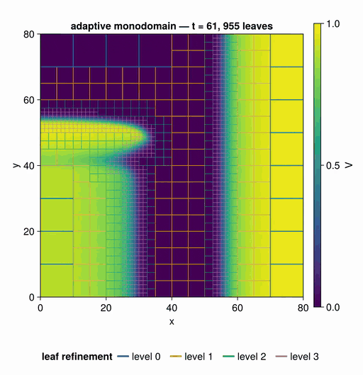

[](https://github.com/RallypointOne/MatrixFreeOperators.jl/actions/workflows/CI.yml)
[](https://github.com/RallypointOne/MatrixFreeOperators.jl/actions/workflows/Docs.yml)
[](https://RallypointOne.github.io/MatrixFreeOperators.jl/stable/)
[](https://RallypointOne.github.io/MatrixFreeOperators.jl/dev/)

# MatrixFreeOperators.jl

Matrix-free linear and nonlinear operators for solving PDEs on structured grids,
built for device-agnostic execution (CPU/GPU) and efficient forward- and
reverse-mode automatic differentiation — including gradients with respect to
operator parameters for inverse problems and PDE-constrained optimization. The
package exposes a composable operator algebra (`L1 * L2`, `L1 + L2`,
`adjoint(L)`), feeds Krylov.jl through a flat `mul!` boundary, and steps
explicitly in time through field-level `apply!`.

<p align="center">
  
  <br>
  <sub><b>Refinement that follows the physics.</b> Aliev–Panfilov monodomain on a <code>BlockForest</code>:
  <code>regrid!</code> refines on |∇V|, so resolution tracks the depolarization wavefront and coarsens
  behind it while an S1–S2 protocol breaks a planar wave into a reentrant spiral.
  — <a href="examples/monodomain_amr.jl">examples/monodomain_amr.jl</a></sub>
</p>

> Status: early development — the public API is not yet stable.

## Motivation

Discretizing a PDE on a structured grid produces a sparse matrix whose entries
are almost entirely redundant: a 7-point Laplacian stencil stores the same
handful of coefficients millions of times. Assembling that matrix costs memory,
and applying it is bandwidth-bound on exactly the data you didn't need to store.
A *matrix-free* operator skips assembly and applies the stencil on the fly —
which is how large structured-grid solves are done on GPUs.

But once you go matrix-free, three things that a stored matrix gave you for free
become your problem:

1. **Algebra.** With matrices, `A + B`, `A * B`, and `A'` just work. Matrix-free
   codes typically hand Krylov a single monolithic apply-function, and every new
   model variant (add a reaction term, swap a coefficient) means editing that
   function by hand.
2. **Adjoints and boundary conditions.** `adjoint(L)` of a stencil is not the
   stencil reversed — boundary conditions break self-adjointness even for the
   Laplacian. Getting `⟨Lx, y⟩ = ⟨x, Lᵀy⟩` right by hand, per operator, per BC,
   is where matrix-free adjoint codes quietly go wrong.
3. **Differentiability.** Inverse problems and PDE-constrained optimization need
   gradients not just through the solution field but with respect to operator
   *parameters* (a material-coefficient field, say). Hand-written kernels need
   hand-written adjoint rules for every backend.

MatrixFreeOperators.jl solves all three at once with one design decision:
operator bodies are written as **array-level broadcasts** over halo-padded
fields. A single code path is then device-agnostic (GPUArrays + Adapt move it to
any backend), differentiable by Enzyme (the default backend) and Mooncake with no
per-operator rules — field *and* parameter gradients — and traceable for compiler
stacks, with KernelAbstractions `@kernel` available as a per-operator escape hatch
for hot stencils. Custom AD rules exist as an *optimization* on top of that path,
not as a prerequisite for it. On top of that sit:

- a **lazy operator algebra** — leaves like `laplacian`, `gradient`,
  `divergence`, `scaling`, `diffusion`, `advection` bind a grid at construction
  and compose under `+`, `-`, `*`, scalar scaling, and `adjoint`, so an operator
  like ∇·(κ∇u) is a one-liner — `diffusion(g, κ)` for the compact flux form a
  κ-inversion wants, and the algebra is general enough that
  `divergence(g) * scaling(κ) * gradient(g)` assembles one too;
- **declared adjoints with correct boundary contributions** for every linear
  leaf, verified by the dot-product identity, with a strict linear/affine split
  (inhomogeneous boundary data is exported via `boundary_rhs`, never baked into
  the operator action);
- a **zero-allocation solver boundary** — `prepare(L, x)` walks the operator
  tree once, allocates all scratch buffers, and returns an object whose
  `mul!`/`size`/`eltype` is exactly what Krylov.jl consumes;
- **honest nonlinearity** — nonlinear operators support `apply!` and AD but
  refuse `adjoint`/`prepare`; `linearize(F, u₀)` produces the matrix-free
  Jacobian that feeds Krylov, which is the JFNK pattern. The JVP is a central
  finite difference by default and an exact forward-mode AD product under
  `linearize(F, u₀, EnzymeJVP())`, which additionally supplies the transpose.

## Quickstart

Install (not yet registered):

```julia
using Pkg
Pkg.add(url = "https://github.com/RallypointOne/MatrixFreeOperators.jl")
```

Solve the variable-coefficient Helmholtz problem −Δu + σu = f on the unit
square with homogeneous Dirichlet BCs, against a manufactured solution
u = sin(πx)sin(πy):

```julia
using MatrixFreeOperators, Krylov, LinearAlgebra

# A 32×32 uniform grid on (0,1)². BCs default to homogeneous Dirichlet;
# the grid carries spacing, halo padding, and boundary conditions, so
# operators built on it need no further configuration.
g = CartesianGrid(((0.0, 1.0), (0.0, 1.0)), (32, 32))

# σ(x,y) = 1 + xy as a coefficient field. Fields are device arrays plus
# grid metadata; set! fills them from a function of position.
σ = set!(scalar_field(g), x -> 1 + x[1] * x[2])

# The operator is composed symbolically — no matrix is ever assembled.
K = scaling(σ) - laplacian(g)

# Manufactured right-hand side for u = sin(πx)sin(πy).
f = set!(scalar_field(g), x -> (2π^2 + 1 + x[1] * x[2]) * sinpi(x[1]) * sinpi(x[2]))

# prepare walks the operator tree once and allocates all scratch buffers;
# the result supports mul!/size/eltype with zero steady-state allocations,
# which is exactly the interface Krylov.jl consumes.
P = prepare(K, scalar_field(g))
u, stats = cg(P, flatten(f))

# Compare against the exact solution on the interior DOFs.
u_exact = flatten(set!(scalar_field(g), x -> sinpi(x[1]) * sinpi(x[2])))
maximum(abs, u .- u_exact)   # ~1e-3, second-order accurate
```

Everything composes from here with the same pieces:

- `diffusion(g, κ)` — variable-coefficient diffusion ∇·(κ∇u) as a single compact flux-form leaf: exactly symmetric for real κ, with an `operator_diagonal`, coupling adjacent solution cells, and ~3× faster than composing it. This removes the wide stencil's odd–even decoupling in u; arithmetic face averaging still leaves a checkerboard ambiguity in κ on even-sized periodic grids or under homogeneous Neumann walls.
- `divergence(g) * scaling(κ) * gradient(g)` — the same PDE term assembled from
  rank-changing leaves. Reach for `diffusion` instead: this spelling exists to
  show the algebra composes, and chaining two centered differences gives it a
  stencil that reaches `u[I±2δ]` but never `u[I±δ]`;
- `adjoint(L)` — the declared adjoint including boundary contributions, ready
  for adjoint-based optimization;
- `boundary_rhs(L, g)` — the lift vector for inhomogeneous BCs, folded into the
  solve RHS so the operator itself stays linear;
- `apply!(du, L, u)` — the explicit time-stepping idiom: the operator acting on
  fields directly, with no flat copies. `prepare` + `mul!` is the Krylov
  boundary and pays for a copy into and out of a halo-padded scratch field on
  every call, which a Krylov solve needs and an explicit integrator does not —
  see `examples/heat_equation.jl`;
- `linearize(F, u₀)` — the matrix-free Jacobian of a nonlinear operator such as
  `advection`, for implicit stepping and JFNK;
- gradients through `apply` with respect to the input field *or* the coefficient
  field `σ`, via Enzyme (default) or Mooncake, with
  [DifferentiationInterface.jl](https://github.com/JuliaDiff/DifferentiationInterface.jl)
  as the recommended frontend — see `examples/inverse_diffusion.jl`;
- `prepare_distributed(L, nparts)` — the same operator partitioned into slabs
  across several GPUs, one `CartesianGrid` per device, with the ghost exchange
  driven from inside the operator tree.

See the [documentation](https://RallypointOne.github.io/MatrixFreeOperators.jl/stable/)
for the full operator catalog, GPU usage, the multi-GPU path, and AD examples.
There is no OrdinaryDiffEq.jl / SciML integration yet: handing prepared
operators to the SciML integrator stack is planned work, tracked in
[#81](https://github.com/RallypointOne/MatrixFreeOperators.jl/issues/81).

## Comparison with related packages

Several excellent Julia packages live near this space; none covers the
intersection this package targets.

- **[SciMLOperators.jl](https://github.com/SciML/SciMLOperators.jl)** provides a
  lazy operator algebra, but a *generic* one: it has no notion of grids,
  stencils, boundary conditions, or PDE adjoints — you supply the apply
  functions, and it supplies the composition, with the SciML `(u,p,t)`
  convention and `cache_operator` ceremony attached. MatrixFreeOperators.jl
  supplies the operators themselves (with declared, BC-correct adjoints) and
  keeps a plain `mul!` interface; a thin SciMLOperators adapter is planned only
  as the `jac_prototype` hook for implicit OrdinaryDiffEq stepping
  ([#65](https://github.com/RallypointOne/MatrixFreeOperators.jl/issues/65)).
- **[LinearMaps.jl](https://github.com/JuliaLinearAlgebra/LinearMaps.jl)** and
  **[LinearOperators.jl](https://github.com/JuliaSmoothOptimizers/LinearOperators.jl)**
  wrap a user-supplied function as a linear map for iterative solvers. They are
  the right tool when you already have the apply-function; they offer no help
  writing it — no PDE semantics, no boundary handling, no parameter gradients.
- **[ParallelStencil.jl](https://github.com/omlins/ParallelStencil.jl)** (with
  ImplicitGlobalGrid.jl) is a kernel-authoring DSL: outstanding at
  device-portable stencil kernels and GPU-aware MPI halo exchange, but it has no
  first-class operator objects (`L1 * L2`, `adjoint(L)`), no declared adjoints,
  and no AD story for parameter gradients. It sits one layer *below* this
  package, and its backend-dispatch ideas informed this design. Its multi-node
  MPI reach is still ahead of `prepare_distributed`, which today partitions
  across the GPUs of a single node.
- **[Oceananigans.jl](https://github.com/CliMA/Oceananigans.jl)** is the closest
  architectural sibling — KernelAbstractions-based, composable operators,
  multi-architecture — but it is a full ocean model, not a reusable operator
  library you can point at your own PDE.
- **[DiffEqOperators.jl](https://github.com/SciML/DiffEqOperators.jl)** was the
  previous SciML take on finite-difference operators; it is deprecated, and its
  successors (MethodOfLines.jl) take the symbolic, matrix-assembly route.
- **[Gridap.jl](https://github.com/gridap/Gridap.jl)** /
  **[Ferrite.jl](https://github.com/Ferrite-FEM/Ferrite.jl)** target finite
  elements on unstructured meshes with assembled sparse matrices — a different
  discretization world.

**The gap this package fills:** a reusable operator *algebra* for
structured-grid PDEs in which the same operator definition is simultaneously
(1) composable, with declared adjoints that get boundary conditions right,
(2) device-agnostic without per-backend code, (3) differentiable end-to-end —
through the solution field *and* operator parameters — without needing a
per-operator AD rule to make it work at all, and (4) zero-allocation behind
`mul!` for Krylov hot loops. Existing
packages each deliver one or two of these; the array-level authoring model is
what lets this package deliver all four from a single operator definition.
